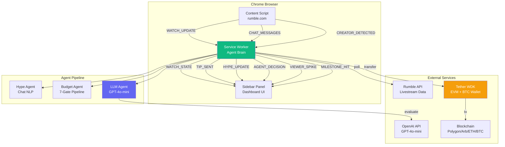
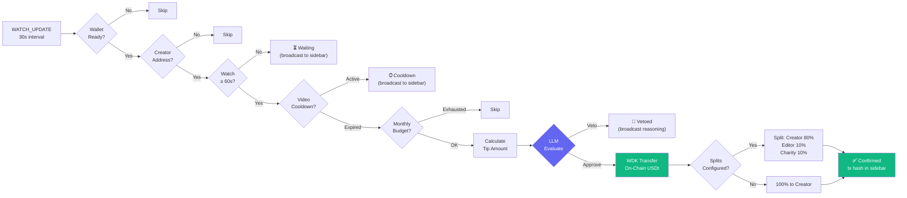
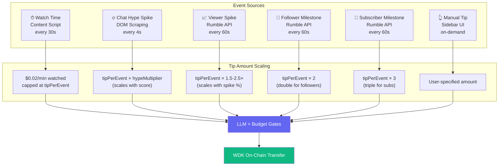

# TipStream — AI-Powered Autonomous Tipping for Rumble Creators

> A Chrome sidebar extension that watches Rumble videos with you and autonomously tips creators with real USDt on-chain — using AI reasoning, live chat hype detection, viewer spike analysis, milestone tracking, and smart splits.

**Track:** 💸 Tipping Bot — Hackathon Galactica: WDK Edition 1 by Tether  
**Demo Video:** [YouTube](https://youtu.be/4iJJDH2PUEk)  
**OpenClaw Skill:** [`openclaw-skill/`](./skill/SKILL.md)

---

## Feature Summary

| Feature                        | Description                                                             | Status              |
| ------------------------------ | ----------------------------------------------------------------------- | ------------------- |
| **Watch-Time Auto-Tipping**    | Tips creators automatically every cooldown period while you watch       | ✅ Real on-chain    |
| **Chat Hype Detection**        | NLP analysis of live chat: velocity, keywords, emoji density, sentiment | ✅ 4-signal scoring |
| **Viewer Spike Detection**     | Detects live viewer count jumps (≥50% increase) and tips on spikes      | ✅ API polling      |
| **Follower Milestones**        | Auto-tips 2× when followers cross 10/25/50/100/500/1K/5K/10K/50K/100K   | ✅ 13 thresholds    |
| **Subscriber Milestones**      | Auto-tips 3× on subscriber milestones                                   | ✅ 13 thresholds    |
| **AI Reasoning (GPT-4o-mini)** | LLM evaluates every tip decision with confidence scoring and reasoning  | ✅ Trigger-aware    |
| **Rule-Based Fallback**        | Works without API key — pure budget/cooldown logic                      | ✅ Graceful         |
| **Smart Splits**               | Auto-split tips between creator + collaborators/causes (configurable %) | ✅ Multi-transfer   |
| **Community Pools**            | Pool viewer funds, distribute to creator on hype spikes                 | ✅ Configurable     |
| **BTC Tipping**                | Bitcoin tips via WDK-wallet-btc alongside EVM USDt                      | ✅ Dual wallet      |
| **Multi-Chain**                | Polygon, Arbitrum, Ethereum, Sepolia, Bitcoin                           | ✅ 5 chains         |
| **Multi-Token**                | USDt, USAt, XAUt, BTC                                                   | ✅ 4 tokens         |
| **Creator Wallet Detection**   | 3-step HTMX extraction of creator's EVM + BTC addresses                 | ✅ Automatic        |
| **Per-Creator Budgets**        | Monthly caps, per-tip limits, cooldown timers per creator               | ✅ Persistent       |
| **Real-Time Agent Log**        | Live feed of every AI decision, gate check, tip, and event              | ✅ In sidebar       |
| **On-Page Tip Badge**          | Smooth 1-second timer overlay on video player                           | ✅ Animated         |
| **On-Page Tip Toast**          | Notification when tip is sent with amount, creator, and tx hash         | ✅ Animated         |
| **Non-Custodial Wallet**       | BIP-39 HD seed phrase, stored in extension only                         | ✅ Self-custodial   |
| **OpenClaw Skill**             | 149-line agent orchestration spec for AI platform integration           | ✅ Full spec        |
| **SPA Navigation**             | Detects page changes on Rumble without full reload                      | ✅ MutationObserver |

---

## How It Works

```
You watch a Rumble video
         │
         ▼
┌─────────────────────────────────────────────────────────┐
│  Content Script (runs on rumble.com)                    │
│                                                         │
│  • Detects video + creator (JSON-LD, meta, selectors)   │
│  • Extracts wallet via 3-step HTMX (EVM + BTC)         │
│  • Tracks watch time (play/pause/seek)                  │
│  • Scrapes live chat every 4 seconds                    │
│  • Sends WATCH_UPDATE every 30s with ALL data           │
└──────────────────────┬──────────────────────────────────┘
                       │
                       ▼
┌─────────────────────────────────────────────────────────┐
│  Service Worker (agent brain)                           │
│                                                         │
│  WATCH_UPDATE ──→ Budget gates ──→ LLM eval ──→ WDK tip│
│  CHAT_MESSAGES ──→ Hype NLP ──→ Spike? ──→ LLM ──→ tip│
│  Alarm (60s) ──→ API poll ──→ Viewer spike? ──→ tip    │
│                            ──→ Follower milestone? ──→ │
│                            ──→ Subscriber milestone? ──→│
└──────────────────────┬──────────────────────────────────┘
                       │
                       ▼
┌─────────────────────────────────────────────────────────┐
│  Sidebar UI (stays open alongside Rumble)               │
│                                                         │
│  NOW WATCHING: OptimusDan [VOD]     2:30 watched        │
│  AGENT LOG: ✅ $0.03 → OptimusDan [AI 72%]             │
│  HYPE: 45/100 ████░░░░                                  │
│  STATS: $1.50 tipped | 12 tips | OptimusDan favorite   │
└─────────────────────────────────────────────────────────┘
```

---

## Architecture



---

## Tipping Decision Pipeline

Every 30 seconds, when you're watching a Rumble video:



---

## Event-Triggered Tipping



---

## Chat Hype Analysis

The Hype Agent scrapes `#chat-history-list` from Rumble's DOM every 4 seconds and computes a composite score:

| Signal            | Weight | How It Works                                                                    |
| ----------------- | ------ | ------------------------------------------------------------------------------- |
| **Chat Velocity** | 35%    | Messages per second. 5 msg/s = max score                                        |
| **Keyword Hits**  | 25%    | 35+ hype terms: goat, lfg, fire, based, hype, pog, sheesh, bussin, tip, usdt... |
| **Emoji Density** | 20%    | 🔥🚀💪👑🙌💯⚡🎉❤️💰 + unicode emoji detection                                  |
| **Sentiment**     | 20%    | Positive vs negative keyword ratio. Negative: boring, trash, cringe, ratio...   |

Score ≥ hype threshold (default 70) = **SPIKE** → triggers immediate tip evaluation.

---

## Viewer Spike Detection

Polls Rumble's Livestream API every 60 seconds. Compares `watching_now` to previous value:

| Condition                             | Action                       |
| ------------------------------------- | ---------------------------- |
| Viewers jump ≥50% AND ≥10 new viewers | Spike detected               |
| 50-100% increase                      | Tip at 1.5× base amount      |
| 100-200% increase                     | Tip at 2× base amount        |
| 200%+ increase                        | Tip at 2.5× base amount      |
| Spike cooldown                        | 5 minutes between spike tips |

Example: `watching_now` goes from 200 → 450 (+125%) → auto-tip at 2× base ($1.00 instead of $0.50).

---

## Smart Splits

Configure per-creator splits in the TIP tab. When a tip fires (any trigger), the amount is divided:

```
$0.50 tip to OptimusDan (splits: Editor 10%, Charity 10%)
  → $0.40 USDt → OptimusDan (0x10c6...)   ✅ tx: 0xabc...
  → $0.05 USDt → Editor (0x742f...)        ✅ tx: 0xdef...
  → $0.05 USDt → Charity (0x9f3a...)       ✅ tx: 0x123...
```

Each split fires a separate WDK on-chain transfer. Splits capped at 50% per recipient, 80% total.

---

## Setup

### Prerequisites

- Node.js 18+
- Chrome/Chromium browser

### 1. Clone & Install

```bash
git clone https://github.com/AadityaSrivastava/tipstream.git
cd tipstream
npm install
```

### 2. Build

```bash
npm run build
```

This produces `dist/background.js`, `dist/content.js`, and `dist/sidebar.js`.

### 3. Load Extension

1. Open `chrome://extensions/`
2. Enable **Developer mode** (top right)
3. Click **Load unpacked** → select the `tipstream-ext` folder
4. Pin the TipStream icon in your toolbar

### 4. Connect Wallet

1. Click the TipStream icon → sidebar opens
2. Click **GENERATE SEED PHRASE** (or paste existing)
3. Click **CONNECT**
4. Fund your wallet:
   - **Sepolia ETH** (gas): https://cloud.google.com/application/web3/faucet/ethereum/sepolia
   - **Test USDt**: https://dashboard.pimlico.io/test-erc20-faucet (select Sepolia + USDT)

### 5. Connect Rumble API

1. Get your API key at https://rumble.com/account/livestream-api
2. Paste into the Rumble card on the dashboard
3. Click **CONNECT RUMBLE**

### 6. (Optional) Enable AI Reasoning

1. Go to **SET** tab
2. Paste your OpenAI API key (`sk-...`)
3. Click **SAVE API KEY**
4. AI badge changes from `RULES` to `AI`

### 7. Watch & Tip

1. Navigate to any Rumble video
2. The sidebar shows "NOW WATCHING: [Creator]" with live timer
3. After 60 seconds, the first auto-tip fires
4. Every cooldown period, another tip fires
5. On livestreams, chat hype and viewer spikes trigger bonus tips

---

## Project Structure

```
tipstream-ext/
├── manifest.json                    # MV3 manifest (sidePanel, alarms, storage)
├── package.json                     # WDK + WDK-EVM + WDK-BTC + polyfills
├── webpack.config.js                # sodium-javascript alias, Node polyfills
├── openclaw-skill/
│   ├── skill.json                   # OpenClaw manifest (9 capabilities)
│   └── SKILL.md                     # 149-line agent orchestration spec
├── sidebar/
│   ├── sidebar.html                 # 4-tab UI: DASH / TIP / LOG / SET
│   └── sidebar.css                  # Neo-brutalist dark theme
└── src/
    ├── background/
    │   ├── service-worker.js        # Message router, autonomous tipping, milestones, viewer spikes
    │   ├── wallet.js                # WDK EVM + BTC wallet, sendTip, sendBtcTip, sendSplitTip
    │   ├── store.js                 # chrome.storage persistence, creators+splits+btc, milestones
    │   ├── config.js                # 5 chains, token addresses, agent defaults
    │   ├── hype-agent.js            # Chat NLP: velocity, keywords, emoji, sentiment
    │   ├── budget-agent.js          # 7-gate decision pipeline
    │   └── llm-agent.js             # GPT-4o-mini with trigger-aware prompts
    ├── content/
    │   └── content.js               # Video tracking, 3-step HTMX wallet+BTC, chat scraping
    └── sidebar/
        └── sidebar.js               # All UI logic: agent log, splits, BTC, watching state
```

---

## Bounty Requirements Mapping

| Bounty Requirement                            | How TipStream Addresses It                                                                                                          |
| --------------------------------------------- | ----------------------------------------------------------------------------------------------------------------------------------- |
| **Build on Rumble's existing tipping wallet** | Detects creator wallets via Rumble's HTMX endpoints. WDK matches Rumble's self-custodial architecture. Polls Rumble Livestream API. |
| **Use agents to enhance tipping**             | 3 agents (Hype, Budget, Tipper) + GPT-4o-mini LLM layer. Every decision logged with reasoning.                                      |
| **Automation**                                | Auto-tips fire every cooldown period from WATCH_UPDATE. No manual intervention needed.                                              |
| **Personalization**                           | Per-creator budgets, cooldowns, tip amounts, enabled triggers.                                                                      |
| **Conditional logic**                         | 7-gate pipeline: enabled → trigger allowed → monthly cap → cooldown → address → calculate → cap.                                    |
| **Creator monetization**                      | Automated micro-tips reward watch time. Community pools let fans fund collectively.                                                 |
| **USDt as base asset**                        | All auto-tips are real USDt ERC-20 transfers via WDK.                                                                               |
| **WDK for wallet + tx**                       | `@tetherto/wdk` + `@tetherto/wdk-wallet-evm` + `@tetherto/wdk-wallet-btc`                                                           |
| **Fan engagement**                            | Live chat hype detection rewards engaged communities. Viewer spikes reward growing audiences.                                       |
| **Real-time interactions**                    | Sidebar agent log shows every decision live. On-page badge + toast notifications.                                                   |
| **OpenClaw**                                  | Full 149-line skill spec in `openclaw-skill/SKILL.md`                                                                               |
| **Community-driven tipping pools**            | Create named pools with hype thresholds, fund and distribute.                                                                       |
| **Smart splits**                              | Per-creator split config: collaborators, editors, charities get auto-split percentages.                                             |
| **Event-triggered tipping**                   | Chat hype spikes, viewer count spikes, follower milestones, subscriber milestones.                                                  |

---

## Tech Stack

| Layer     | Technology                                                                |
| --------- | ------------------------------------------------------------------------- |
| Extension | Chrome MV3, Manifest V3 Side Panel API                                    |
| Wallet    | `@tetherto/wdk` + `@tetherto/wdk-wallet-evm` + `@tetherto/wdk-wallet-btc` |
| Tokens    | USDt (ERC-20) on Polygon/Arbitrum/Ethereum/Sepolia + BTC                  |
| AI        | GPT-4o-mini via OpenAI API (optional, rule-based fallback)                |
| NLP       | Custom hype analysis: keyword matching, sentiment, velocity, emoji        |
| Rumble    | Livestream API polling + DOM chat scraping + HTMX wallet extraction       |
| Build     | Webpack 5, sodium-javascript, Node.js polyfills                           |
| Styling   | Custom CSS (neo-brutalist dark theme)                                     |

---

## Network Cost Guide

| Chain        | Gas Cost | Best For                                 |
| ------------ | -------- | ---------------------------------------- |
| **Polygon**  | ~$0.001  | Micro-tips, high frequency (recommended) |
| **Arbitrum** | ~$0.01   | Medium tips                              |
| **Ethereum** | ~$1-5    | Large tips only                          |
| **Bitcoin**  | ~$0.50-5 | BTC tips to bc1 addresses                |
| **Sepolia**  | Free     | Testing (default)                        |

---

## What's Real (Not Simulated)

| Component                | Status   | Details                                                           |
| ------------------------ | -------- | ----------------------------------------------------------------- |
| WDK wallet init          | **Real** | BIP-39 seed → EVM address + BTC address                           |
| USDt balance query       | **Real** | `account.getTokenBalance(usdtAddress)`                            |
| USDt transfer            | **Real** | `account.transfer({ token, recipient, amount })` — real ERC-20 tx |
| BTC balance query        | **Real** | `btcAccount.getBalance()` via Electrum                            |
| BTC transfer             | **Real** | `btcAccount.sendTransaction({ to, value })`                       |
| Rumble API polling       | **Real** | Hits `rumble.com/-livestream-api/get-data?key=...`                |
| Chat hype analysis       | **Real** | NLP on real DOM-scraped chat messages                             |
| Creator wallet detection | **Real** | 3-step HTMX fetch extracts real addresses                         |
| Budget enforcement       | **Real** | Monthly caps, cooldowns, per-creator rules                        |
| Smart splits             | **Real** | Each split fires a separate on-chain WDK transfer                 |
| AI reasoning             | **Real** | GPT-4o-mini API call with structured JSON output                  |

---

## Confirmed Transactions (Sepolia Testnet)

| Tx Hash                                                                                                               | Type                                   | Amount    | Creator    |
| --------------------------------------------------------------------------------------------------------------------- | -------------------------------------- | --------- | ---------- |
| [`0x02f4d9c5...`](https://sepolia.etherscan.io/tx/0x02f4d9c5355de1526fb8de47976041f5deb11e06522ef8b47b74705b4b07e30f) | Manual tip                             | 0.50 USDt | OptimusDan |
| [`0x7b270b72...`](https://sepolia.etherscan.io/tx/0x7b270b72c3665bddf702233999795c1a08f960b4b0051089f2c7c1aaeec0fef9) | Auto-tip (watch time, AI approved 72%) | 0.03 USDt | OptimusDan |

---

## Third-Party Services

| Service                     | Purpose                                   | Required                 |
| --------------------------- | ----------------------------------------- | ------------------------ |
| Tether WDK                  | Non-custodial wallet, EVM + BTC transfers | Yes                      |
| Rumble Livestream API       | Real-time chat, followers, viewers, rants | Yes                      |
| OpenAI API                  | GPT-4o-mini reasoning (optional)          | No (rule-based fallback) |
| Sepolia RPC (drpc.org)      | Blockchain access                         | Yes (for testnet)        |
| Electrum (blockstream.info) | Bitcoin wallet connectivity               | No (BTC optional)        |

---

## License

Apache License 2.0

---

Built for **Hackathon Galactica: WDK Edition 1** — Tipping Bot Track ($5,000 USDt prize pool)
